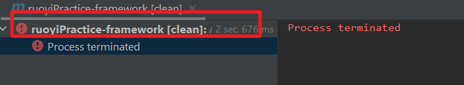

# RuoYi Practice Reporsitory

# 项目结构

1. 打包方式的区别

    父：packaging pom

    子：packaging jar

    > 自行搜索：maven 打包方式的区别

2. 子工程的iml文件为什么可删除

    可以不删，iml保存的是项目的信息，留着也行，ruoyi源码是没删的

3. 项目分层

    引父类pom里面的东西：common项目 大家都会用到的依赖， system 项目引用了common项目的依赖，以此类推

    ruoyi-admin --> ruoyi-framework --> ruoyi-system --> ruoyi-common

    ruoyi-quartz --> ruoyi-common

    rouyi-generator --> ruoyi-common

# 项目启动

ruoyi-admin 是 springboot 的启动类

ruoyi-admin 引入 ruoyi-framework 的 pom，在 ruoyi-framework 中引入 spring boot web starter

> dependencies 和 dependencyManagement 的区别
> spring-boot-starter-parent 和 spring-boot-starter-dependencies 不能被项目直接引入

# 连接数据库

## 添加依赖

mysql

springboot 集成 mybatis

阿里数据库连接池

## springboot 配置 

在 application.yaml 中配置 mybatis 和 druid 相关信息

# 获取数据库中的数据

mapper 都放在 system 模块下？

domain 是实体类

配置类加上扫描 mapper 接口的配置（之前的配置文件只扫描了 mapper xml 文件，并没有把 mapper 接口注册成 bean）

0. 谁把每个mapper加进去了？
1. mapper 是个啥
2. sqlsession是不是真正执行sql的那个
3. springboot-m6ybatis并不会对mapper.xml文件上的namespace的类自动注入bean，所以对于mapper接口需要你自己注入为bean或者是用mapperscan注解

# 其他

1. maven process terminate

    点下图那里可以查看详细报错

    

2. 子工程最好不要定义 groupId 和 version

    子工程自动继承父工程的 groupId 和 version

3. 使用 dependencies 管理项目依赖的版本时， maven project 出现你要导入的内容

    对每个子模块用一下 clean ，看看哪里有报错，解决报错，即可

    > 多模块工程的 maven，在任何一个子模块出错了，整个工程的依赖都导不到

4. `classpath*:mapper/**/*Mapper.xml`

    - `*` 通配符用于匹配当前目录下的任意文件或目录，但不包括子目录中的内容。
    - `**` 通配符用于匹配任意层级的目录。这意味着它可以匹配当前目录及其所有子目录中的文件。
    - `classpath*`: 这个前缀表示不仅匹配当前类路径下的资源，还会匹配所有的类路径，包括所有的 JAR 文件和其他类路径中的资源。

5. [WARNING] The POM for xxx is missing, no dependency inform

    从最顶级的父模块开始 install，全部重新 install 之后就行了